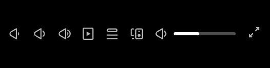

# Volume Profiles v2

###### Built with [Spicetify Creator](https://github.com/FlafyDev/spicetify-creator). Download from [Spicetify Marketplace](https://github.com/CharlieS1103/spicetify-marketplace).

[](https://github.com/notPlancha/Volume-Profiles-Spicetify-Extension-v2)

This extension adds 3 buttons to Spotify (using [spicetify](https://github.com/spicetify/spicetify-cli)), on the bottom right, to save a volume profile, to load it later when needed.

This is the upgraded version of [the first version](https://github.com/notPlancha/volume-profiles-v1), where it's more responsive, more extended, and more Spicy.

## Install
To install it just grab the js in the dist folder, and load it with spicetify. Alternatively, use the marketplace. 

## Contribute it
If you want to contribute it (with a bug, or an issue, or a suggestion), raise an issue or a pull request (make sure to check the TODO in the bottom too)

To develop, use `npm install`, add the extension to the config-xpui.ini (`spicetify -c`), and to run, run `.\run.ps1` on powershell (7 preferentially).

If you get `UnauthorizedAccess`, do:

```pwsh
Set-ExecutionPolicy RemoteSigned -Scope CurrentUser
Unblock-File .\run.ps1
```

If you don't have powershell honestly you'll figure it out.

## Preview



The settings look a bit weird and I plan to fix them soon.


## Notes

* This package uses uzairfarooq's [arrive.js](https://github.com/uzairfarooq/arrive) and franciscop's [umbrella js](https://github.com/franciscop/umbrella)
* It's possible that an update to spotify or spicetify will break your saved volumes, but I've yet to experience this. If this happens, try raising an issue on the github page
[create issue](https://github.com/user/repository/issues/new)
* Same thing for any other issue/bug

## More

- Check me out for possibly future extensions, star the repo if you liked it and watch the repo for updates

[](https://github.com/notPlancha)

[](https://github.com/notPlancha/Volume-Profiles-Spicetify-Extension-v2)

## TODO

* Add a way to put the buttons under the slider (and make that the default since the new Spotify sucks)
* A gif of the images (and testing if said gifs work on the marketplace)
* Fix settings formating
* Fix aria-label (the popup text that should be above the symbols)