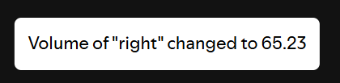

# Volume Profiles

> Built with [Spicetify Creator](https://github.com/FlafyDev/spicetify-creator). Download from [Spicetify Marketplace](https://github.com/CharlieS1103/spicetify-marketplace).

[](https://github.com/notPlancha/Volume-Profiles-Spicetify-Extension-v2)


This extension adds 3 buttons to Spotify (using [spicetify](https://github.com/spicetify/spicetify-cli)), on the bottom right, to save a volume profile, to load it later when needed.
Additionally, you can use keyboard binds (limited, see [#6](https://github.com/notPlancha/volume-profiles-v2/issues/6))




This is the upgraded version of [the first version](https://github.com/notPlancha/volume-profiles-v1), where it's more responsive, more extended, and more Spicy.


## Install
To install it just grab the js in the dist folder, and load it with spicetify by adding it to `config-xpui.ini`. Alternatively, search it up on the [Spicetify Marketplace](https://github.com/CharlieS1103/spicetify-marketplace). 


## Contribute
Feel free to raise any issue or pull request.

### Setup

Run `bun install` (or npm install). This will install all dependencies, restore, backup and enable devtools for spotify, add a pre-commit hook to build `volume-profiles.js` before every commit, and add `volume-profiles.js` to `config-xpui.ini` (in `spicetify -c`). The commands are visible on package.json.

```ini
extensions = volume-profiles.js
# if you want more extensions divide them with a vertical bar
extensions = volume-profiles.js | someotherextension.js
```

Note: To skip these scripts you can do `bun install --ignore-scripts` (or `npm install --ignore-scripts`).

To run the extension, run `bun run build` (or `npm run build`).

## Notes

It's possible that an update to spotify or spicetify will break your saved volumes, but I've yet to experience this. If this happens, try raising an issue on the github page
[create issue](https://github.com/user/repository/issues/new). Same thing for any other issue/bug

## More

- Check me out for possibly future extensions, star the repo if you liked it and watch the repo for updates

[](https://github.com/notPlancha)

[](https://github.com/notPlancha/Volume-Profiles-Spicetify-Extension-v2)

## TODO

* Settings look ugly now for some reason
* Add a way to put the buttons under the slider (and make that the default since the new Spotify sucks)
* Add an overlay (the button turns green) when the volume matches current volume (so when clicked)
* Round the volume when setting with right click
* A gif of the images (and testing if said gifs work on the marketplace)
* Fix settings formating
* Fix aria-label (the popup text that should be above the symbols)
