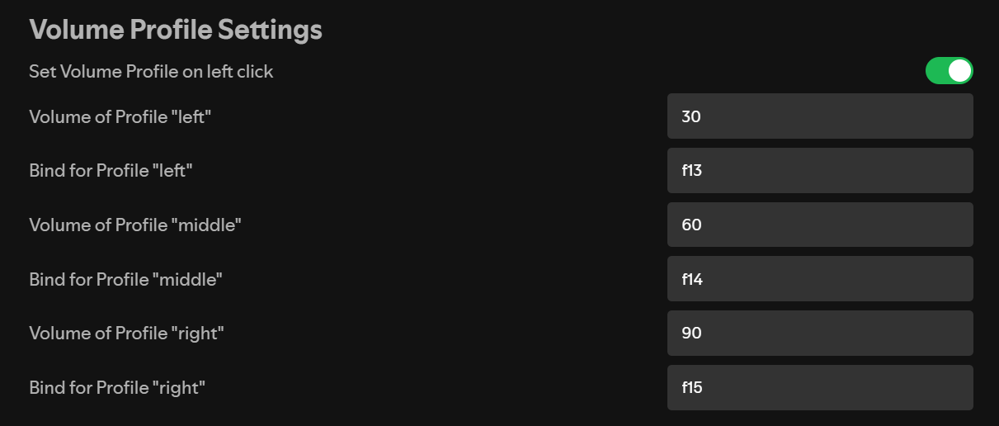

# Volume Profiles v2

This extension adds 3 buttons to Spotify (using [spicetify](https://github.com/spicetify/spicetify-cli)), on the bottom right, to save a volume profile, to load it later when needed.

* It's possible that an update to spotify or spicetify will break your saved volumes, but I've yet to experience this. If this happens, try raising an issue on the github page
  [create issue](https://github.com/user/repository/issues/new)
* Same thing for any other issue/bug, or if you have any suggestion.

If you *really* like the extension, don't hesitate to add a star to it, and watch it for any future update.

